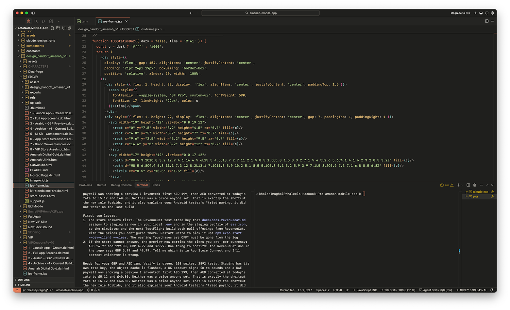

# K7EEL Cursor

A warm charcoal dark theme designed for Cursor and VS Code.



# K7EEL Cursor 🚀

A warm charcoal dark theme designed for Cursor and VS Code, with a restrained orange coding accent, hot-pink AI accent, brighter lime success/string palette, and tuned syntax for PHP, TypeScript, JavaScript, HTML, CSS and Perl.

## Recommended settings

K7EEL Cursor deliberately does not bundle or redistribute fonts. On macOS, SF Mono is a strong fit if you already have it installed; JetBrains Mono is a good cross-platform fallback.

```jsonc
{
  "window.commandCenter": true,
  "workbench.colorTheme": "K7EEL Cursor",
  "workbench.iconTheme": "k7eel-icons",
  "editor.accessibilitySupport": "off",
  "window.autoDetectColorScheme": false,
  "explorer.confirmDelete": false,
  "terminal.integrated.mouseWheelScrollSensitivity": 3,
  "terminal.integrated.gpuAcceleration": "off",

  "editor.fontFamily": "'SF Mono', 'JetBrains Mono', Menlo, Monaco, monospace",
  "editor.fontSize": 14,
  "editor.lineHeight": 23,
  "editor.fontLigatures": true,

  "terminal.integrated.fontFamily": "'SF Mono', 'JetBrains Mono', Menlo, Monaco, monospace",
  "terminal.integrated.fontSize": 13,
  "terminal.integrated.lineHeight": 1.3,

  "debug.console.fontFamily": "'SF Mono', 'JetBrains Mono', Menlo, Monaco, monospace",
  "debug.console.fontSize": 13,
  "editor.codeLensFontFamily": "'SF Mono', 'JetBrains Mono', Menlo, Monaco, monospace",
  "scm.inputFontFamily": "'SF Mono', 'JetBrains Mono', Menlo, Monaco, monospace"
}
```

## Palette

- Charcoal: `#1F1F1D`
- Structural charcoal: `#252523`
- Warm ivory: `#DAD7CF`
- Orange: `#E27A59`
- Hot orange: `#F08361`
- AI pink: `#F06AA6`
- Lime: `#9FCB82` / `#B5D58D`
- Teal: `#82C4BE`
- Gold: `#E0B45C`

## Install

Use **Extensions: Install from VSIX...** in Cursor/VS Code and choose the packaged `.vsix`.
